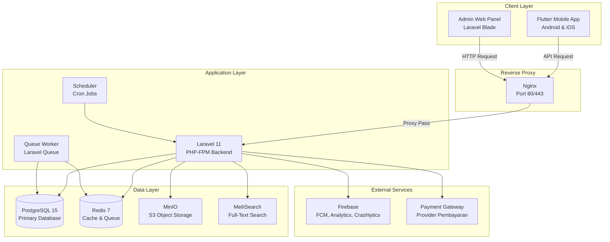

# System Security Plan (SSP) — Skilloka

**Versi Dokumen:** 1.0  
**Tanggal:** 10 Februari 2026  
**Penyusun:** Tim Pengembang Skilloka  
**Status:** Draft

---

## 1. Pendahuluan

Dokumen ini merupakan **System Security Plan (SSP)** untuk aplikasi **Skilloka**, sebuah platform penemuan kursus vokasional hyperlocal di wilayah Indramayu. SSP ini disusun sebagai panduan perencanaan keamanan sistem yang mencakup identifikasi aset, analisis ancaman dan risiko, serta rencana pengamanan yang mengacu pada standar **OWASP Top 10** dan pedoman **Badan Siber dan Sandi Negara (BSSN)**.

Tujuan penyusunan SSP ini adalah:

1. Mengidentifikasi dan mendokumentasikan seluruh aset sistem yang memerlukan perlindungan.
2. Menganalisis potensi ancaman dan risiko keamanan yang dapat mengeksploitasi kerentanan sistem.
3. Merencanakan kontrol keamanan yang tepat untuk memitigasi risiko yang teridentifikasi.
4. Menjadi acuan bagi seluruh tim pengembang dalam menerapkan praktik keamanan selama siklus pengembangan dan operasional sistem.

---

## 2. Deskripsi Sistem

### 2.1 Identifikasi Sistem

| **Atribut**              | **Keterangan**                                                                                  |
| ------------------------ | ----------------------------------------------------------------------------------------------- |
| **Nama Aplikasi**        | Skilloka                                                                                        |
| **Jenis Aplikasi**       | Mobile (Flutter) + Web Admin Panel (Laravel Blade)                                              |
| **Tujuan Sistem**        | Platform penemuan dan pemesanan kursus vokasional hyperlocal di Indramayu                       |
| **Pengguna Sistem**      | Super Admin, Admin LPK (Lembaga Pelatihan Kerja), Siswa/Peserta (Student), Pengguna Publik      |
| **Framework Frontend**   | Flutter (Dart) — SDK ^3.7.0                                                                     |
| **Framework Backend**    | Laravel 11 (PHP ^8.2)                                                                           |
| **Database**             | PostgreSQL 15 (dengan rencana migrasi ke Drizzle ORM)                                           |
| **Cache & Queue**        | Redis 7                                                                                         |
| **Web Server**           | Nginx (Reverse Proxy)                                                                           |
| **Object Storage**       | MinIO (S3-compatible)                                                                           |
| **Search Engine**        | MeiliSearch v1.5                                                                                |
| **Autentikasi**          | Laravel Sanctum (Token-based API Authentication)                                                |
| **Otorisasi**            | Spatie Laravel Permission (Role-Based Access Control)                                           |
| **Push Notification**    | Firebase Cloud Messaging (FCM)                                                                  |
| **Monitoring & Logging** | Spatie Activity Log, Firebase Crashlytics, Firebase Analytics                                   |
| **Containerization**     | Docker & Docker Compose                                                                         |
| **CI/CD**                | GitHub Actions                                                                                  |

### 2.2 Arsitektur Sistem

### 2.3 Model Multi-Tenancy

Sistem Skilloka menggunakan arsitektur **multi-tenancy** berbasis `tenant_id` pada setiap tabel data utama. Setiap LPK (Lembaga Pelatihan Kerja) beroperasi sebagai tenant terpisah, memastikan isolasi data antar lembaga. Seluruh model data di-scope secara otomatis menggunakan trait `BelongsToTenant`.

### 2.4 Entitas Data Utama

| **Entitas**       | **Deskripsi**                                     | **Identifier**  |
| ----------------- | ------------------------------------------------- | --------------- |
| Users             | Akun pengguna (admin, siswa)                      | Auto-increment  |
| Tenants           | Organisasi/LPK sebagai tenant                     | UUID            |
| LPKs              | Lembaga Pelatihan Kerja                           | UUID            |
| Courses           | Kursus yang ditawarkan                            | UUID            |
| Course Schedules  | Jadwal pelaksanaan kursus                         | UUID            |
| Bookings          | Pemesanan kursus oleh siswa                       | UUID            |
| Payments          | Transaksi pembayaran                              | UUID            |
| Certificates      | Sertifikat kelulusan kursus                       | UUID            |
| Reviews           | Ulasan dari peserta kursus                        | UUID            |
| Categories        | Kategori kursus                                   | UUID            |
| Locations         | Data lokasi/kecamatan                             | UUID            |
| LPK Verifications | Riwayat verifikasi LPK                            | UUID            |

---

## 3. Identifikasi Aset

| **No** | **Aset Sistem**                  | **Jenis Aset**   | **Deskripsi**                                                                                   | **Tingkat Kepentingan** |
| ------ | -------------------------------- | ---------------- | ----------------------------------------------------------------------------------------------- | ----------------------- |
| 1      | Data Pengguna (Users)            | Data             | Nama, email, nomor telepon, password (hashed), avatar, lokasi, dan FCM token pengguna           | **Tinggi**              |
| 2      | Data Transaksi (Payments)        | Data             | Informasi pembayaran: metode, provider, external ID, jumlah, status, dan metadata transaksi     | **Tinggi**              |
| 3      | Data Booking                     | Data             | Pemesanan kursus: kode booking, status, jumlah, QR code, dan waktu kedaluwarsa                  | **Tinggi**              |
| 4      | Data Sertifikat                  | Data             | Nomor sertifikat, file URL, tanggal terbit, dan tanggal kedaluwarsa                             | **Tinggi**              |
| 5      | Kredensial Login & Token         | Data             | Password pengguna (bcrypt hashed), API token Sanctum, dan session data                          | **Tinggi**              |
| 6      | Data LPK                        | Data             | Informasi lembaga: nama, NIB, alamat, koordinat, fasilitas, kontak, dan status verifikasi       | **Tinggi**              |
| 7      | Database Server (PostgreSQL)     | Infrastruktur    | Server database utama menyimpan seluruh data aplikasi                                           | **Tinggi**              |
| 8      | Redis Server                     | Infrastruktur    | Server cache dan queue untuk session, cache data, dan antrian job                               | **Tinggi**              |
| 9      | Nginx Web Server                 | Infrastruktur    | Reverse proxy yang menangani seluruh traffic masuk ke aplikasi                                   | **Tinggi**              |
| 10     | MinIO Object Storage             | Infrastruktur    | Penyimpanan file seperti gambar kursus, logo LPK, avatar, dan file sertifikat                   | **Tinggi**              |
| 11     | MeiliSearch Server               | Infrastruktur    | Mesin pencarian full-text untuk discovery kursus                                                | **Sedang**              |
| 12     | Akun Super Admin                 | Akun             | Akun dengan hak akses penuh terhadap seluruh tenant dan konfigurasi sistem                      | **Tinggi**              |
| 13     | Akun Admin LPK                   | Akun             | Akun pengelola LPK dengan akses manajemen kursus, booking, dan siswa per tenant                 | **Tinggi**              |
| 14     | Source Code (Backend)            | Aplikasi         | Kode program Laravel termasuk API endpoint, middleware, dan business logic                      | **Sedang**              |
| 15     | Source Code (Mobile)             | Aplikasi         | Kode program Flutter termasuk UI, state management, dan integrasi API                           | **Sedang**              |
| 16     | Konfigurasi Environment (.env)   | Konfigurasi      | File konfigurasi berisi kredensial database, API key, secret key, dan konfigurasi layanan        | **Tinggi**              |
| 17     | Docker Configuration             | Konfigurasi      | File Docker Compose dan Dockerfile yang mendefinisikan infrastruktur deployment                  | **Sedang**              |
| 18     | Firebase Credentials             | Konfigurasi      | API key dan konfigurasi Firebase untuk FCM, Analytics, dan Crashlytics                          | **Tinggi**              |
| 19     | CI/CD Pipeline (GitHub Actions)  | Infrastruktur    | Pipeline otomatis untuk build, test, dan deployment aplikasi                                    | **Sedang**              |
| 20     | Activity Log                     | Data             | Log aktivitas pengguna dan sistem menggunakan Spatie Activity Log                               | **Sedang**              |

> Aset-aset di atas merupakan komponen penting dalam sistem Skilloka yang apabila terganggu dapat menyebabkan kebocoran data pengguna dan transaksi, gangguan layanan platform, hilangnya kepercayaan pengguna dan mitra LPK, atau kerugian finansial dan operasional. Oleh karena itu, aset dengan tingkat kepentingan **tinggi** menjadi prioritas utama dalam perencanaan pengamanan sistem, terutama aset yang berkaitan langsung dengan data pribadi pengguna, transaksi keuangan, dan kredensial akses.

---

## 4. Analisis Ancaman dan Risiko

| **No** | **Aset Terkait**                         | **Ancaman**                            | **Referensi (OWASP/BSSN)**             | **Dampak Risiko**                                                                        | **Tingkat Risiko** |
| ------ | ---------------------------------------- | -------------------------------------- | -------------------------------------- | ---------------------------------------------------------------------------------------- | ------------------ |
| 1      | Data Pengguna, Database                  | SQL Injection                          | OWASP A03:2021 — Injection             | Kebocoran seluruh data pengguna, manipulasi data, atau penghapusan data                    | **Tinggi**         |
| 2      | Admin Web Panel                          | Cross-Site Scripting (XSS)             | OWASP A03:2021 — Injection             | Pencurian session cookie admin, defacement halaman, penyebaran malware                     | **Tinggi**         |
| 3      | Kredensial Login, Akun Admin             | Brute Force Attack                     | OWASP A07:2021 — Identification & Auth | Pengambilalihan akun admin/pengguna, akses tidak sah ke panel manajemen                    | **Tinggi**         |
| 4      | Kredensial Login, Token Sanctum          | Broken Authentication                  | OWASP A07:2021 — Identification & Auth | Token dicuri atau disalahgunakan, session hijacking, akses ilegal ke API                   | **Tinggi**         |
| 5      | Data Transaksi, Data Booking             | Insecure Direct Object Reference (IDOR)| OWASP A01:2021 — Broken Access Control | Pengguna mengakses data booking/pembayaran milik pengguna lain                             | **Tinggi**         |
| 6      | Seluruh Data Sensitif                    | Data Breach / Data Exposure            | OWASP A02:2021 — Cryptographic Failures| Kebocoran data sensitif (password, data pribadi, transaksi) ke pihak tidak berwenang       | **Tinggi**         |
| 7      | Nginx, Docker, MinIO                     | Security Misconfiguration              | OWASP A05:2021 — Security Misconfig    | Akses tidak sah ke server, eksposur informasi sensitif, system downtime                    | **Tinggi**         |
| 8      | API Endpoint                             | Broken Access Control                  | OWASP A01:2021 — Broken Access Control | Eskalasi privilege, cross-tenant data access, modifikasi data tanpa otorisasi              | **Tinggi**         |
| 9      | Source Code, Environment Config          | Sensitive Data Exposure di Repository  | OWASP A02:2021 — Cryptographic Failures| Kredensial (DB password, API key) bocor melalui commit di git repository                   | **Tinggi**         |
| 10     | Database, Object Storage                 | Data Loss / Kehilangan Data            | BSSN — Ketersediaan Data               | Hilangnya data pengguna, transaksi, dan sertifikat secara permanen                         | **Tinggi**         |
| 11     | API Endpoint, Server                     | Denial of Service (DoS/DDoS)           | BSSN — Ketersediaan Layanan            | Layanan tidak dapat diakses, gangguan operasional bagi seluruh pengguna dan LPK            | **Sedang**         |
| 12     | Data Pengguna (PII)                      | Pelanggaran Privasi Data               | BSSN — UU PDP (Perlindungan Data Pribadi)| Pelanggaran regulasi, denda, tuntutan hukum, dan hilangnya kepercayaan pengguna           | **Tinggi**         |
| 13     | Data Transaksi, Payment Gateway          | Man-in-the-Middle (MitM) Attack        | OWASP A02:2021 — Cryptographic Failures| Intersepsi data transaksi pembayaran, manipulasi data dalam transit                        | **Tinggi**         |
| 14     | Mobile App (Flutter)                     | Reverse Engineering & Tampering        | OWASP Mobile — M8, M9                  | Ekstraksi API key, manipulasi logika bisnis pada sisi klien                                | **Sedang**         |
| 15     | Mobile App, Credential Storage           | Insecure Data Storage (Mobile)         | OWASP Mobile — M2                      | Token atau kredensial dicuri dari perangkat yang di-root/jailbreak                          | **Sedang**         |
| 16     | Docker Container, Dependencies           | Vulnerable & Outdated Components       | OWASP A06:2021 — Vulnerable Components | Eksploitasi kerentanan pada library pihak ketiga (Laravel, npm packages, Docker images)    | **Sedang**         |
| 17     | Activity Log, Server Log                 | Insufficient Logging & Monitoring      | OWASP A09:2021 — Security Logging      | Serangan tidak terdeteksi, kesulitan forensik, ketidakmampuan audit keamanan               | **Sedang**         |
| 18     | Cross-Tenant Data                        | Multi-Tenancy Data Leakage             | OWASP A01:2021 — Broken Access Control | Data LPK satu tenant terekspos ke tenant lain akibat kelemahan isolasi data                | **Tinggi**         |
| 19     | File Upload (Gambar, Sertifikat)         | Unrestricted File Upload               | OWASP A04:2021 — Insecure Design       | Upload file berbahaya (web shell) yang memungkinkan remote code execution di server        | **Tinggi**         |
| 20     | QR Code Booking                          | QR Code Forgery / Replay Attack        | BSSN — Integritas Data                 | Pemalsuan QR code booking untuk mengakses kursus tanpa pembayaran yang sah                  | **Sedang**         |

> Ancaman yang diidentifikasi mengacu pada **OWASP Top 10 (2021)**, **OWASP Mobile Security**, dan pedoman **BSSN (Badan Siber dan Sandi Negara)**. Risiko tertinggi terdapat pada aset yang berkaitan dengan **data pribadi pengguna**, **kredensial autentikasi**, **data transaksi keuangan**, dan **isolasi multi-tenancy** karena dapat berdampak langsung pada keamanan, privasi, dan keberlangsungan operasional sistem. Ancaman terkait infrastruktur seperti misconfiguration dan DoS juga menjadi perhatian penting mengingat arsitektur sistem yang terdiri dari multiple services (PostgreSQL, Redis, Nginx, MinIO, MeiliSearch) yang masing-masing harus diamankan secara independen.

---

## 5. Rencana Pengamanan Sistem

| **No** | **Risiko**                            | **Rencana Pengamanan**                                                                                                                                                 | **Referensi**    |
| ------ | ------------------------------------- | ---------------------------------------------------------------------------------------------------------------------------------------------------------------------- | ---------------- |
| 1      | SQL Injection                         | Penggunaan **Drizzle ORM** dengan prepared statements dan parameterized queries; validasi dan sanitasi seluruh input pengguna pada sisi server                          | OWASP            |
| 2      | Cross-Site Scripting (XSS)            | Escaping output pada template Blade (`{{ }}`); penerapan **Content Security Policy (CSP)** header; sanitasi input HTML                                                  | OWASP            |
| 3      | Brute Force Attack                    | Pembatasan percobaan login (**rate limiting**) pada endpoint autentikasi; implementasi **CAPTCHA** setelah beberapa kali percobaan gagal; notifikasi login mencurigakan  | OWASP            |
| 4      | Broken Authentication                 | Konfigurasi **token expiration** pada Sanctum; penggunaan **HTTPS** untuk seluruh komunikasi; implementasi **refresh token** rotation                                   | OWASP            |
| 5      | IDOR / Broken Access Control          | Validasi otorisasi pada setiap endpoint API berbasis **Spatie Permission**; pengecekan kepemilikan resource (ownership check) sebelum akses data                        | OWASP            |
| 6      | Data Breach / Data Exposure           | Enkripsi password menggunakan **bcrypt**; enkripsi data sensitif at rest; penggunaan **HTTPS/TLS** untuk data in transit; minimisasi data yang diekspos melalui API      | OWASP, BSSN      |
| 7      | Security Misconfiguration             | Hardening konfigurasi Nginx, Redis, PostgreSQL, dan MinIO; nonaktifkan debug mode di produksi; audit konfigurasi Docker secara berkala                                  | OWASP            |
| 8      | Cross-Tenant Data Leakage            | Penerapan **global scope** `BelongsToTenant` pada seluruh model; validasi `tenant_id` pada setiap query; unit test untuk memastikan isolasi data antar tenant            | OWASP            |
| 9      | Sensitive Data di Repository          | Penggunaan file `.gitignore` untuk mengecualikan `.env`; penyimpanan secret di **environment variables** pada server; penggunaan **secret scanning** di GitHub           | OWASP            |
| 10     | Kehilangan Data (Data Loss)           | **Backup database** PostgreSQL secara berkala (harian); backup object storage MinIO; strategi **disaster recovery** dengan replikasi data                                | BSSN             |
| 11     | Denial of Service (DoS/DDoS)          | Penerapan **rate limiting** pada Nginx dan Laravel; konfigurasi firewall; penggunaan **CDN** untuk distribusi traffic; auto-scaling pada infrastruktur                   | BSSN             |
| 12     | Pelanggaran Privasi Data (UU PDP)     | Penerapan **privacy by design**; consent mechanism untuk pengumpulan data; kebijakan retensi data; fitur penghapusan akun oleh pengguna                                 | BSSN, UU PDP     |
| 13     | Man-in-the-Middle (MitM)              | Penggunaan **HTTPS/TLS 1.3** untuk seluruh komunikasi; **SSL pinning** pada aplikasi mobile Flutter; validasi sertifikat SSL                                            | OWASP            |
| 14     | Reverse Engineering (Mobile)          | Penggunaan **flutter_jailbreak_detection** untuk mendeteksi perangkat yang di-root/jailbreak; code obfuscation pada build production                                    | OWASP Mobile     |
| 15     | Insecure Data Storage (Mobile)        | Penyimpanan token dan kredensial menggunakan **flutter_secure_storage** (Keychain/Keystore); tidak menyimpan data sensitif di shared preferences                        | OWASP Mobile     |
| 16     | Vulnerable Components                 | Audit dependensi secara berkala (`composer audit`, `npm audit`, `flutter pub outdated`); automated dependency update via **Dependabot**; pembaruan Docker image rutin    | OWASP            |
| 17     | Insufficient Logging & Monitoring     | Implementasi **Spatie Activity Log** untuk audit trail; centralized logging pada Docker; penggunaan **Firebase Crashlytics** untuk monitoring error                      | OWASP            |
| 18     | Unrestricted File Upload              | Validasi tipe dan ukuran file; pembatasan ekstensi file yang diizinkan; penyimpanan file di **MinIO** (terpisah dari web server); scan malware pada file upload          | OWASP            |
| 19     | QR Code Forgery                       | Penandatanganan QR code dengan **HMAC**; validasi one-time-use pada sisi server; enkripsi payload QR code dengan timestamp                                              | BSSN             |
| 20     | Eskalasi Privilege                    | Penerapan **principle of least privilege** pada role assignment; audit berkala hak akses admin; pemisahan role Super Admin dan Admin LPK                                  | OWASP, BSSN      |

> Rencana pengamanan sistem di atas disusun sebagai langkah preventif untuk meminimalkan risiko keamanan pada seluruh lapisan arsitektur Skilloka — dari aplikasi mobile, API backend, hingga infrastruktur server. Implementasi kontrol keamanan ini diharapkan mampu melindungi seluruh aset sistem serta menjaga **kerahasiaan** (*confidentiality*), **integritas** (*integrity*), dan **ketersediaan** (*availability*) data sesuai dengan prinsip CIA Triad. Penggunaan **Drizzle ORM** sebagai ORM database akan memperkuat lapisan keamanan pada akses data dengan mekanisme prepared statement bawaan, sementara arsitektur multi-tenancy yang ketat memastikan isolasi data antar lembaga pelatihan.

---

## 6. Ringkasan Kontrol Keamanan per Lapisan

### 6.1 Lapisan Aplikasi Mobile (Flutter)

| **Kontrol**                   | **Implementasi**                                              |
| ----------------------------- | ------------------------------------------------------------- |
| Secure Storage                | `flutter_secure_storage` (Keychain iOS / Keystore Android)    |
| Jailbreak/Root Detection      | `flutter_jailbreak_detection`                                 |
| Network Security              | SSL Pinning, HTTPS-only                                       |
| Code Protection               | Obfuscation pada build release                                |
| Autentikasi Lokal             | `local_auth` (biometrik) untuk akses sensitive                |
| State Management              | `flutter_bloc` — state immutable, event-driven                |

### 6.2 Lapisan API Backend (Laravel 11)

| **Kontrol**                   | **Implementasi**                                              |
| ----------------------------- | ------------------------------------------------------------- |
| Autentikasi                   | Laravel Sanctum (token-based)                                 |
| Otorisasi                     | Spatie Permission (RBAC)                                      |
| Input Validation              | Laravel Form Request Validation                               |
| Database Security             | Drizzle ORM (prepared statements)                             |
| Rate Limiting                 | Laravel Rate Limiter pada endpoint sensitif                   |
| CSRF Protection               | Middleware `ValidateCsrfToken` untuk web routes               |
| CORS Policy                   | Konfigurasi strict CORS untuk domain yang diizinkan           |
| Activity Logging              | Spatie Activity Log untuk audit trail                         |
| Soft Deletes                  | Data pengguna tidak dihapus permanen (`SoftDeletes`)          |

### 6.3 Lapisan Infrastruktur

| **Kontrol**                   | **Implementasi**                                              |
| ----------------------------- | ------------------------------------------------------------- |
| Reverse Proxy                 | Nginx dengan HTTPS/TLS                                        |
| Container Isolation           | Docker network terpisah (`skilloka-network`)                  |
| Database Security             | PostgreSQL dengan credential terenkripsi, akses via internal network |
| Cache Security                | Redis dengan `maxmemory-policy`, akses internal only          |
| Object Storage                | MinIO dengan access key authentication                        |
| Search Engine                 | MeiliSearch dengan master key authentication                  |
| Health Checks                 | Healthcheck pada setiap container Docker                      |
| CI/CD Security                | GitHub Actions dengan secret management                       |

---

## 7. Rencana Implementasi dan Prioritas

| **Prioritas** | **Kontrol Keamanan**                      | **Status**     | **Target Implementasi** |
| ------------- | ----------------------------------------- | -------------- | ----------------------- |
| P1 — Kritis   | HTTPS/TLS pada seluruh komunikasi         | Perlu diterapkan | Sebelum deployment      |
| P1 — Kritis   | Validasi input dan prepared statements    | Sebagian aktif | Sprint berikutnya       |
| P1 — Kritis   | Autentikasi & otorisasi berbasis role     | Aktif          | Penyempurnaan berkelanjutan |
| P1 — Kritis   | Isolasi multi-tenancy                     | Aktif          | Penyempurnaan berkelanjutan |
| P1 — Kritis   | Enkripsi password (bcrypt)                | Aktif          | Sudah diterapkan        |
| P2 — Tinggi   | Rate limiting pada endpoint autentikasi   | Perlu diterapkan | Sprint berikutnya       |
| P2 — Tinggi   | Backup database berkala                   | Perlu diterapkan | Sebelum deployment      |
| P2 — Tinggi   | Validasi file upload                      | Perlu diterapkan | Sprint berikutnya       |
| P2 — Tinggi   | Secure storage pada mobile                | Aktif          | Sudah diterapkan        |
| P3 — Sedang   | SSL Pinning pada mobile                   | Perlu diterapkan | Sebelum rilis produksi  |
| P3 — Sedang   | Code obfuscation pada Flutter             | Perlu diterapkan | Sebelum rilis produksi  |
| P3 — Sedang   | Automated dependency scanning             | Perlu diterapkan | Sprint berikutnya       |
| P3 — Sedang   | Centralized logging & monitoring          | Sebagian aktif | Sebelum deployment      |
| P4 — Rendah   | Penetration testing                       | Belum          | Setelah MVP             |
| P4 — Rendah   | Privacy impact assessment                 | Belum          | Setelah MVP             |

---

## 8. Penutup

System Security Plan ini disusun sebagai dokumen hidup (*living document*) yang akan terus diperbarui seiring dengan perkembangan fitur dan infrastruktur aplikasi Skilloka. Perencanaan keamanan yang tercantum dalam dokumen ini mengacu pada standar internasional **OWASP Top 10 (2021)** untuk keamanan aplikasi web, **OWASP Mobile Security** untuk keamanan aplikasi mobile, serta pedoman **BSSN** dan **Undang-Undang Perlindungan Data Pribadi (UU PDP)** untuk kepatuhan regulasi nasional.

Seluruh anggota tim pengembang bertanggung jawab untuk memahami dan menerapkan kontrol keamanan yang telah direncanakan. Review keamanan akan dilakukan secara berkala, minimal setiap kali terdapat perubahan signifikan pada arsitektur sistem atau penambahan fitur baru. Dengan penerapan rencana pengamanan ini, diharapkan sistem Skilloka mampu menyediakan layanan yang **aman**, **andal**, dan **terpercaya** bagi seluruh pemangku kepentingan.

---

*Dokumen ini disusun pada 10 Februari 2026 dan berlaku hingga dilakukan revisi berikutnya.*
