# Skilloka - Diagram UML untuk Dokumen SDD & SRS

> Dokumen ini berisi seluruh diagram teknis sistem Skilloka untuk kelengkapan laporan Software Design Document (SDD) dan Software Requirements Specification (SRS).

---

## 1. Use Case Diagram

```mermaid
graph TB
    subgraph "Sistem Skilloka"
        UC1["🔍 Mencari LPK / Kursus"]
        UC2["📋 Melihat Detail Kursus"]
        UC3["📋 Melihat Detail LPK"]
        UC4["📝 Booking Kursus"]
        UC5["💳 Melakukan Pembayaran"]
        UC6["⭐ Memberikan Review"]
        UC7["📜 Melihat Sertifikat"]
        UC8["🔐 Login / Register"]
        UC9["👤 Mengelola Profil"]
        UC10["📍 Filter Lokasi"]

        UC11["📊 Melihat Dashboard"]
        UC12["📚 Mengelola Kursus"]
        UC13["👥 Mengelola Siswa"]
        UC14["📋 Mengelola Booking"]
        UC15["✅ Verifikasi Kehadiran"]

        UC16["🏛️ Dashboard Super Admin"]
        UC17["🏢 Mengelola Tenant/LPK"]
        UC18["📂 Mengelola Kategori"]
        UC19["✅ Verifikasi LPK"]
    end

    Peserta["👤 Peserta/User"]
    Admin["👨‍💼 Admin LPK"]
    SuperAdmin["🛡️ Super Admin"]

    Peserta --> UC8
    Peserta --> UC1
    Peserta --> UC2
    Peserta --> UC3
    Peserta --> UC4
    Peserta --> UC5
    Peserta --> UC6
    Peserta --> UC7
    Peserta --> UC9
    Peserta --> UC10

    Admin --> UC8
    Admin --> UC11
    Admin --> UC12
    Admin --> UC13
    Admin --> UC14
    Admin --> UC15

    SuperAdmin --> UC16
    SuperAdmin --> UC17
    SuperAdmin --> UC18
    SuperAdmin --> UC19

    UC4 -.->|include| UC5
    UC6 -.->|include| UC4
    UC7 -.->|include| UC4
```

### Tabel Deskripsi Use Case

| No | Use Case | Aktor | Deskripsi |
|----|----------|-------|-----------|
| UC1 | Mencari LPK/Kursus | Peserta | Mencari LPK atau kursus berdasarkan keyword, kategori, lokasi |
| UC2 | Melihat Detail Kursus | Peserta | Melihat informasi lengkap kursus: silabus, jadwal, harga, ulasan |
| UC3 | Melihat Detail LPK | Peserta | Melihat profil LPK: fasilitas, kursus tersedia, rating |
| UC4 | Booking Kursus | Peserta | Mendaftar ke jadwal kursus yang tersedia |
| UC5 | Melakukan Pembayaran | Peserta | Membayar via VA Bank atau E-Wallet |
| UC6 | Memberikan Review | Peserta | Memberi penilaian & komentar setelah kursus selesai |
| UC7 | Melihat Sertifikat | Peserta | Mengunduh sertifikat kelulusan kursus |
| UC8 | Login/Register | Semua | Autentikasi via OTP telepon atau social login |
| UC9 | Mengelola Profil | Peserta | Mengubah data diri, foto, lokasi |
| UC10 | Filter Lokasi | Peserta | Filter berdasarkan kecamatan Indramayu |
| UC11 | Melihat Dashboard | Admin LPK | Melihat statistik booking, pendapatan, siswa |
| UC12 | Mengelola Kursus | Admin LPK | CRUD kursus dan jadwal |
| UC13 | Mengelola Siswa | Admin LPK | Melihat dan mengelola data peserta kursus |
| UC14 | Mengelola Booking | Admin LPK | Melihat, mengubah status booking peserta |
| UC15 | Verifikasi Kehadiran | Admin LPK | Scan QR Code untuk verifikasi kehadiran peserta |
| UC16 | Dashboard Super Admin | Super Admin | Melihat overview seluruh LPK dan sistem |
| UC17 | Mengelola Tenant/LPK | Super Admin | Mengelola pendaftaran dan status LPK |
| UC18 | Mengelola Kategori | Super Admin | CRUD kategori kursus |
| UC19 | Verifikasi LPK | Super Admin | Memverifikasi legalitas dan kelayakan LPK |

---

## 2. ERD (Entity Relationship Diagram)

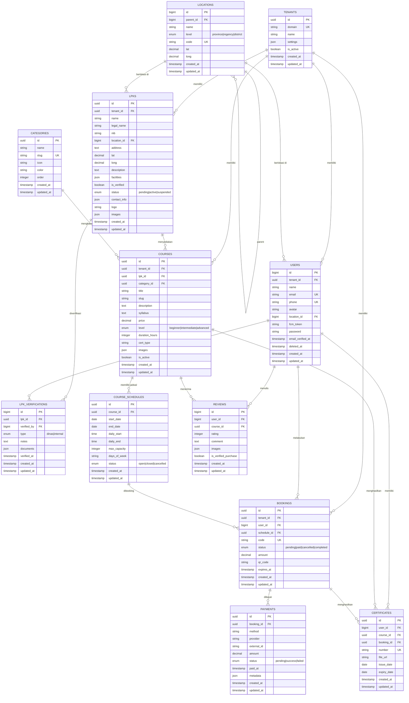

---

## 3. Activity Diagram

### 3.1 Activity Diagram — Proses Booking Kursus

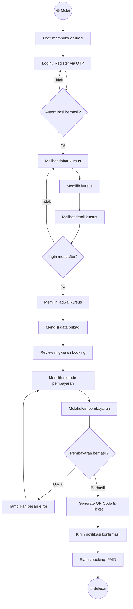

### 3.2 Activity Diagram — Proses Verifikasi LPK

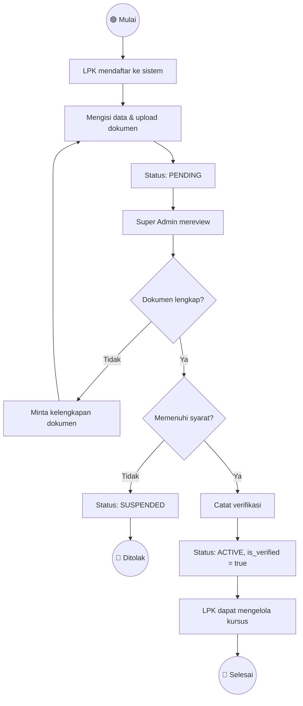

### 3.3 Activity Diagram — Proses Review Kursus

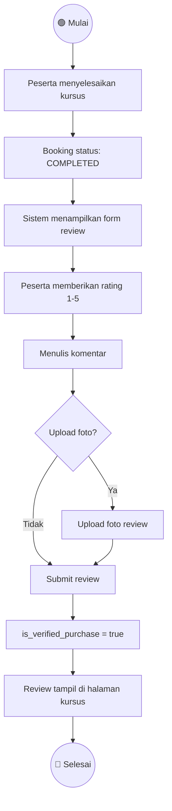

---

## 4. Sequence Diagram

### 4.1 Sequence Diagram — Booking & Pembayaran

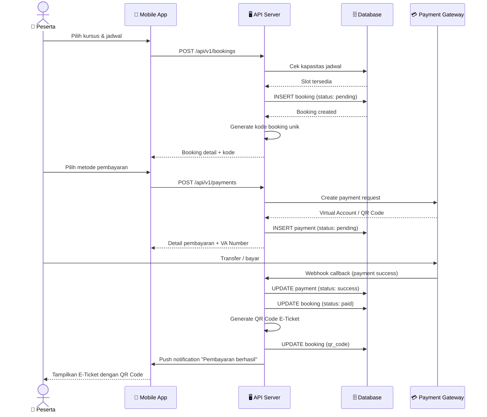

### 4.2 Sequence Diagram — Login OTP

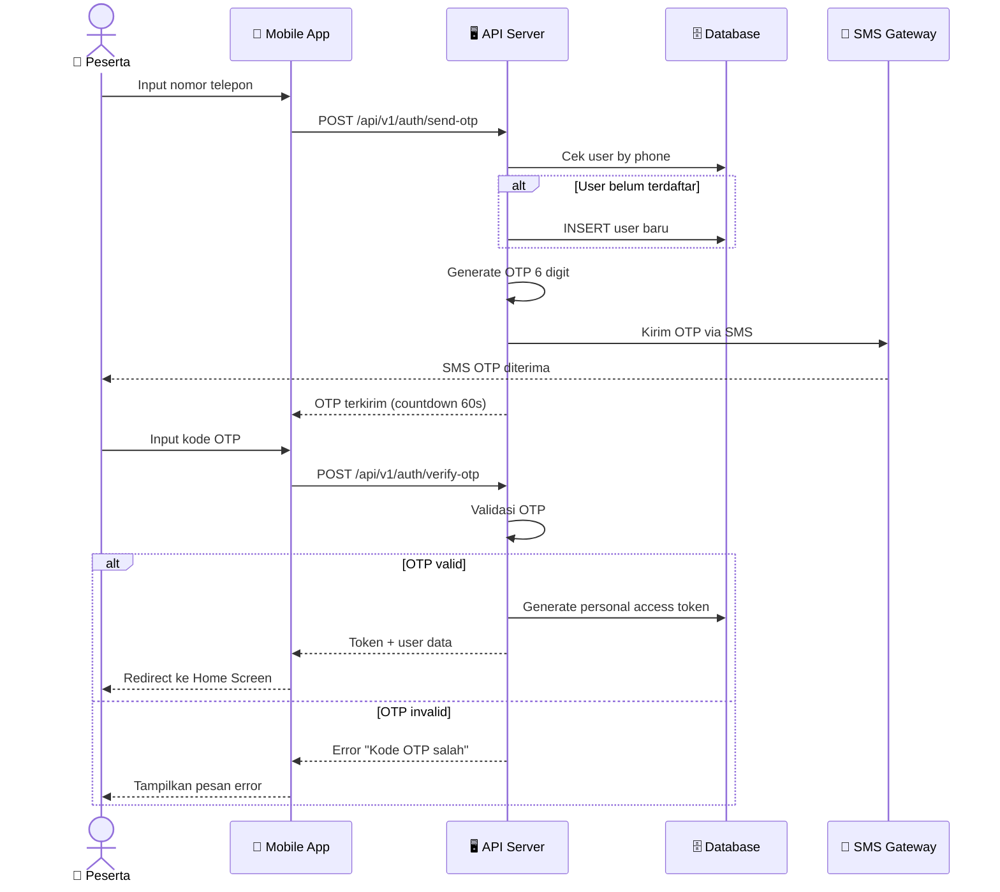

### 4.3 Sequence Diagram — Admin Mengelola Kursus

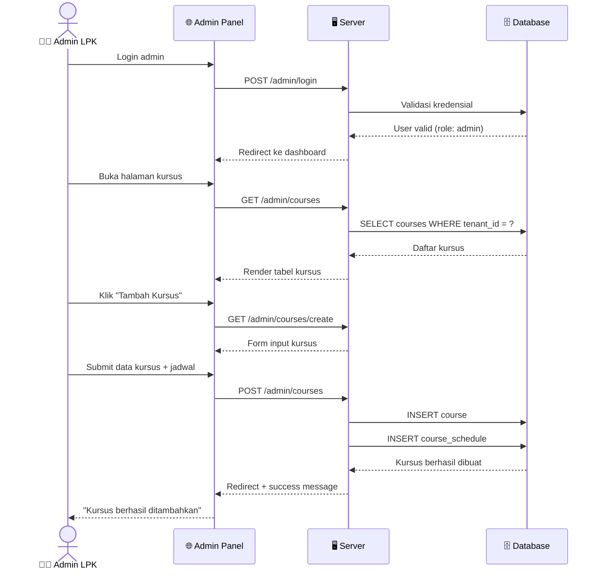

---

## 5. Flowchart

### 5.1 Flowchart — Alur Utama Sistem Skilloka

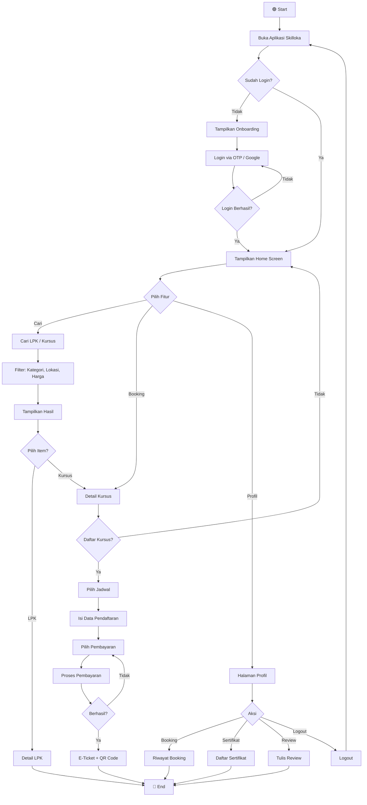

### 5.2 Flowchart — Proses Pembayaran

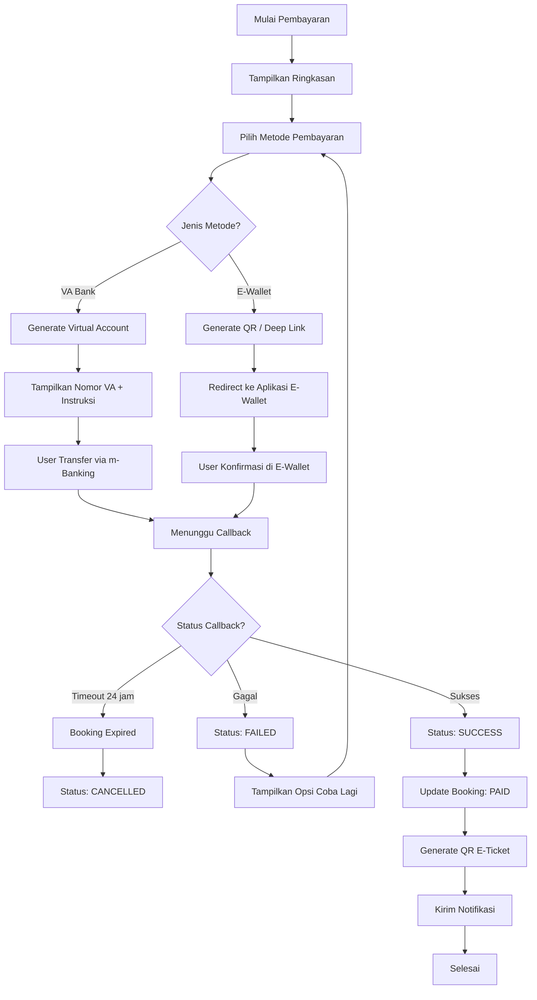

---

## 6. Class Diagram

```mermaid
classDiagram
    class Tenant {
        +UUID id
        +String domain
        +String name
        +JSON settings
        +Boolean is_active
        +hasMany() users
        +hasMany() lpks
        +hasMany() courses
        +hasMany() bookings
    }

    class User {
        +BigInt id
        +UUID tenant_id
        +String name
        +String email
        +String phone
        +String avatar
        +BigInt location_id
        +String fcm_token
        +belongsTo() tenant
        +belongsTo() location
        +hasMany() bookings
        +hasMany() reviews
        +hasMany() certificates
    }

    class Location {
        +BigInt id
        +BigInt parent_id
        +String name
        +Enum level
        +String code
        +Decimal lat
        +Decimal long
        +parent() location
        +children() locations
        +hasMany() users
        +hasMany() lpks
    }

    class Lpk {
        +UUID id
        +UUID tenant_id
        +String name
        +String legal_name
        +String nib
        +BigInt location_id
        +String address
        +Decimal lat
        +Decimal long
        +Text description
        +JSON facilities
        +Boolean is_verified
        +Enum status
        +JSON contact_info
        +String logo
        +JSON images
        +belongsTo() tenant
        +belongsTo() location
        +hasMany() courses
        +hasMany() verifications
    }

    class LpkVerification {
        +BigInt id
        +UUID lpk_id
        +BigInt verified_by
        +Enum type
        +Text notes
        +JSON documents
        +Timestamp verified_at
        +belongsTo() lpk
        +belongsTo() verifier
    }

    class Category {
        +UUID id
        +String name
        +String slug
        +String icon
        +String color
        +Integer order
        +hasMany() courses
    }

    class Course {
        +UUID id
        +UUID tenant_id
        +UUID lpk_id
        +UUID category_id
        +String title
        +String slug
        +Text description
        +Text syllabus
        +Decimal price
        +Enum level
        +Integer duration_hours
        +String cert_type
        +JSON images
        +Boolean is_active
        +belongsTo() tenant
        +belongsTo() lpk
        +belongsTo() category
        +hasMany() schedules
        +hasMany() reviews
        +hasMany() certificates
    }

    class CourseSchedule {
        +UUID id
        +UUID course_id
        +Date start_date
        +Date end_date
        +Time daily_start
        +Time daily_end
        +Integer max_capacity
        +String days_of_week
        +Enum status
        +belongsTo() course
        +hasMany() bookings
        +availableSlots() int
    }

    class Booking {
        +UUID id
        +UUID tenant_id
        +BigInt user_id
        +UUID schedule_id
        +String code
        +Enum status
        +Decimal amount
        +String qr_code
        +Timestamp expires_at
        +belongsTo() tenant
        +belongsTo() user
        +belongsTo() schedule
        +hasOne() payment
        +hasOne() certificate
        +isPaid() bool
        +isExpired() bool
    }

    class Payment {
        +UUID id
        +UUID booking_id
        +String method
        +String provider
        +String external_id
        +Decimal amount
        +Enum status
        +Timestamp paid_at
        +JSON metadata
        +belongsTo() booking
        +isSuccess() bool
    }

    class Review {
        +BigInt id
        +BigInt user_id
        +UUID course_id
        +Integer rating
        +Text comment
        +JSON images
        +Boolean is_verified_purchase
        +belongsTo() user
        +belongsTo() course
    }

    class Certificate {
        +UUID id
        +BigInt user_id
        +UUID course_id
        +UUID booking_id
        +String number
        +String file_url
        +Date issue_date
        +Date expiry_date
        +belongsTo() user
        +belongsTo() course
        +belongsTo() booking
        +isValid() bool
    }

    Tenant "1" --> "*" User : memiliki
    Tenant "1" --> "*" Lpk : memiliki
    Tenant "1" --> "*" Course : memiliki
    Tenant "1" --> "*" Booking : memiliki

    Location "1" --> "*" Location : parent-child
    Location "1" --> "*" User : berlokasi
    Location "1" --> "*" Lpk : berlokasi

    Lpk "1" --> "*" Course : menyediakan
    Lpk "1" --> "*" LpkVerification : diverifikasi

    Category "1" --> "*" Course : mengkategorikan

    Course "1" --> "*" CourseSchedule : memiliki
    Course "1" --> "*" Review : menerima
    Course "1" --> "*" Certificate : menghasilkan

    CourseSchedule "1" --> "*" Booking : dibooking

    User "1" --> "*" Booking : melakukan
    User "1" --> "*" Review : menulis
    User "1" --> "*" Certificate : memiliki

    Booking "1" --> "0..1" Payment : dibayar
    Booking "1" --> "0..1" Certificate : menghasilkan
```

---

## Catatan Konvensi

| Simbol | Keterangan |
|--------|-----------|
| `PK` | Primary Key |
| `FK` | Foreign Key |
| `UK` | Unique Key |
| `UUID` | Universally Unique Identifier |
| `1 --> *` | One-to-Many relationship |
| `1 --> 0..1` | One-to-Zero-or-One relationship |
| `include` | Use case dependency |

> **Tools**: Diagram dibuat menggunakan Mermaid.js dan dapat di-render pada GitHub, VS Code (ekstensi Markdown Preview Mermaid), atau website [mermaid.live](https://mermaid.live).
