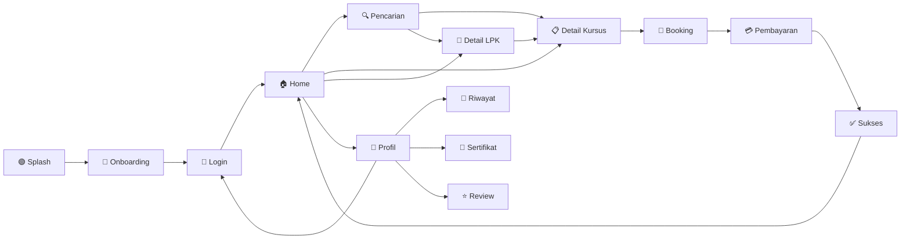
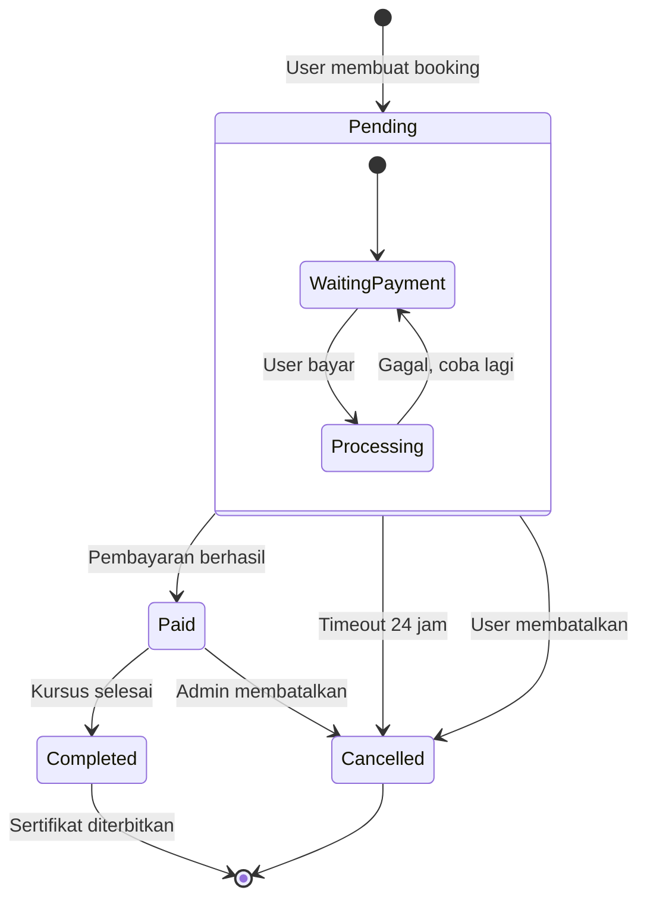
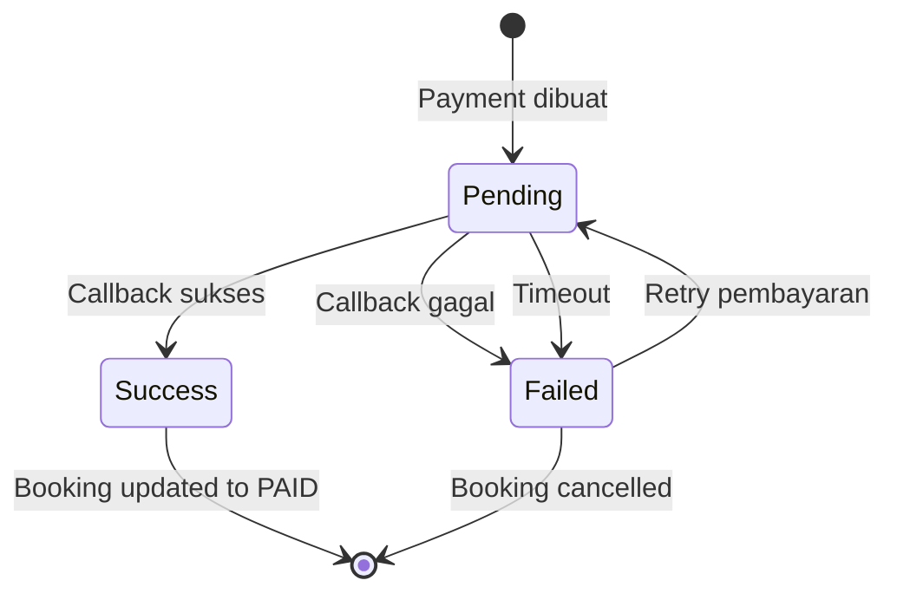
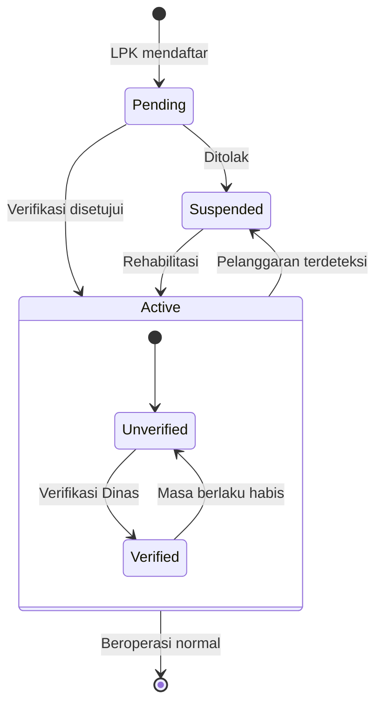
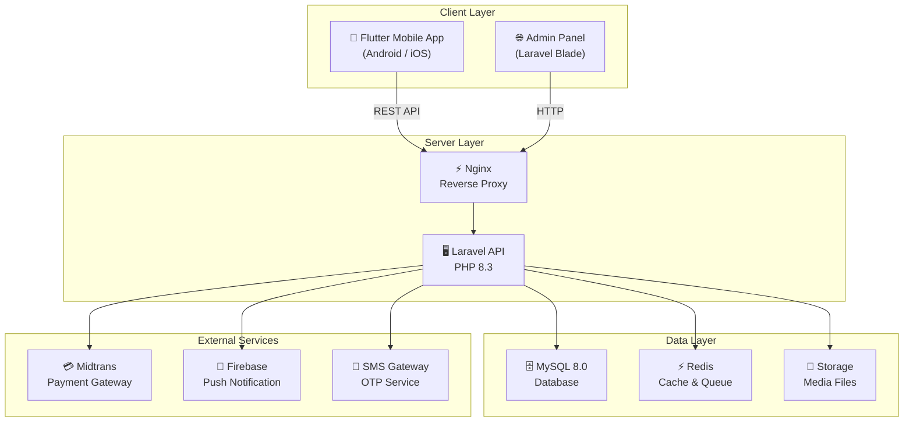

# Skilloka — ASCII Wireframe & Mermaid Diagrams
## Dokumen Pendukung SDD & SRS

---

## 1. Wireframe — Splash Screen

```
┌──────────────────────────────┐
│          STATUS BAR          │
│                              │
│                              │
│                              │
│                              │
│         ┌──────────┐         │
│         │          │         │
│         │  LOGO    │         │
│         │ SKILLOKA │         │
│         │          │         │
│         └──────────┘         │
│                              │
│      S K I L L O K A         │
│                              │
│    "Temukan Kursus Terbaik   │
│     di Dekat Anda"           │
│                              │
│        ◌ Loading...          │
│                              │
│                              │
│                              │
└──────────────────────────────┘
```

---

## 2. Wireframe — Onboarding Screen

```
┌──────────────────────────────┐
│                     [Lewati] │
│                              │
│     ┌────────────────────┐   │
│     │                    │   │
│     │   ┌──┐   ┌──┐     │   │
│     │   │🔍│   │📍│     │   │
│     │   └──┘   └──┘     │   │
│     │                    │   │
│     │  Ilustrasi Halaman │   │
│     │       1 / 3        │   │
│     │                    │   │
│     └────────────────────┘   │
│                              │
│   ┌──────────────────────┐   │
│   │  Temukan LPK & Kursus│   │
│   │  Terdekat             │   │
│   └──────────────────────┘   │
│                              │
│   Cari lembaga pelatihan     │
│   kerja berkualitas di       │
│   sekitar Indramayu          │
│                              │
│         ● ○ ○                │
│                              │
│   ┌──────────────────────┐   │
│   │     Selanjutnya →    │   │
│   └──────────────────────┘   │
│                              │
└──────────────────────────────┘
```

---

## 3. Wireframe — Login Screen

```
┌──────────────────────────────┐
│          STATUS BAR          │
│                              │
│   ┌──────────┐               │
│   │ SKILLOKA │               │
│   └──────────┘               │
│                              │
│   Masuk ke Akun              │
│   ─────────────              │
│   Gunakan nomor telepon      │
│   Anda untuk masuk           │
│                              │
│   ┌──────────────────────┐   │
│   │ +62 │ 812-3456-7890  │   │
│   └──────────────────────┘   │
│                              │
│   ┌──────────────────────┐   │
│   │ □□□ □□□              │   │
│   │  Masukkan Kode OTP   │   │
│   └──────────────────────┘   │
│                              │
│   Kirim ulang OTP (58s)      │
│                              │
│   ┌──────────────────────┐   │
│   │ ██████ MASUK ██████  │   │
│   └──────────────────────┘   │
│                              │
│   ──── atau masuk dengan ─── │
│                              │
│   ┌──────────────────────┐   │
│   │ [G] Masuk dgn Google │   │
│   └──────────────────────┘   │
│                              │
│   ┌──────────────────────┐   │
│   │ [🔒] Login Biometrik │   │
│   └──────────────────────┘   │
│                              │
└──────────────────────────────┘
```

---

## 4. Wireframe — Home Screen

```
┌──────────────────────────────┐
│          STATUS BAR          │
│ Selamat Pagi, Budi! 👋      │
│ 📍 Kec. Indramayu            │
│                              │
│ ┌──────────────────────┐     │
│ │ 🔍 Cari kursus...    │     │
│ └──────────────────────┘     │
│                              │
│ ┌──────────────────────────┐ │
│ │ ╔══════════════════════╗ │ │
│ │ ║  HERO BANNER         ║ │ │
│ │ ║  Promo Kursus Las    ║ │ │
│ │ ║  Diskon 20%          ║ │ │
│ │ ╚══════════════════════╝ │ │
│ │       ● ○ ○ ○            │ │
│ └──────────────────────────┘ │
│                              │
│ Kategori                     │
│ ┌────┐┌────┐┌────┐┌────┐    │
│ │ 🔧 ││ 💻 ││ 🍳 ││ ✂️ │    │
│ │Las ││Komp││Tata││Jahit│    │
│ └────┘└────┘└────┘└────┘    │
│                              │
│ LPK Terdekat          [>>]  │
│ ┌────────────────────────┐   │
│ │ 🏢 LPK Mitra Kerja    │   │
│ │ ⭐ 4.8 (128 ulasan)   │   │
│ │ 📍 2.3 km ✅ Verified  │   │
│ └────────────────────────┘   │
│ ┌────────────────────────┐   │
│ │ 🏢 LPK Digital Nusa   │   │
│ │ ⭐ 4.6 (95 ulasan)    │   │
│ │ 📍 3.1 km ✅ Verified  │   │
│ └────────────────────────┘   │
│                              │
│ Kursus Populer        [>>]  │
│ ┌──────────┐ ┌──────────┐   │
│ │ ┌──────┐ │ │ ┌──────┐ │   │
│ │ │ IMG  │ │ │ │ IMG  │ │   │
│ │ └──────┘ │ │ └──────┘ │   │
│ │ Las SMAW │ │ Komputer │   │
│ │ ⭐ 4.5   │ │ ⭐ 4.7   │   │
│ │ Rp 1.5jt │ │ Rp 800rb │   │
│ └──────────┘ └──────────┘   │
│                              │
│ ┌────┬────┬────┬────┐       │
│ │ 🏠 │ 🔍 │ 📋 │ 👤 │       │
│ │Home│Cari│Book│Prof│       │
│ └────┴────┴────┴────┘       │
└──────────────────────────────┘
```

---

## 5. Wireframe — Course Detail Screen

```
┌──────────────────────────────┐
│ [←]                    [♡]  │
│ ┌──────────────────────────┐ │
│ │                          │ │
│ │    COURSE IMAGE GALLERY  │ │
│ │      ◀  1/4  ▶          │ │
│ │                          │ │
│ └──────────────────────────┘ │
│                              │
│  Kursus Las Listrik SMAW     │
│  untuk Pemula                │
│  ─────────────────────────   │
│  LPK Mitra Kerja ✅          │
│                              │
│  ⭐ 4.8  │  👥 50+  │  📍 2km│
│                              │
│  ┌──────────────────────┐    │
│  │ Rp 1.500.000         │    │
│  │ Durasi: 40 jam       │    │
│  │ Level: Pemula        │    │
│  │ Sertifikat: BNSP     │    │
│  └──────────────────────┘    │
│                              │
│  Deskripsi                   │
│  ─────────                   │
│  Kursus ini mengajarkan      │
│  teknik pengelasan SMAW...   │
│  [Baca selengkapnya]         │
│                              │
│  Silabus                     │
│  ─────────                   │
│  ▼ Modul 1: Pengantar       │
│  │  ├ Teori dasar las        │
│  │  └ Keselamatan kerja      │
│  ▶ Modul 2: Praktik Dasar   │
│  ▶ Modul 3: Teknik Lanjut   │
│  ▶ Modul 4: Evaluasi        │
│                              │
│  Jadwal Tersedia             │
│  ─────────────               │
│  ┌──────────────────────┐    │
│  │ ● 15 Feb 2025        │    │
│  │   08:00-12:00  [8]   │    │
│  └──────────────────────┘    │
│  ┌──────────────────────┐    │
│  │ ○ 1 Mar 2025         │    │
│  │   13:00-17:00  [12]  │    │
│  └──────────────────────┘    │
│                              │
│  Ulasan (128)         [>>]  │
│  ─────────────               │
│  ┌──────────────────────┐    │
│  │ 👤 Budi S. ⭐⭐⭐⭐⭐    │    │
│  │ "Instruktur sangat   │    │
│  │  berpengalaman..."   │    │
│  └──────────────────────┘    │
│                              │
│ ┌──────────────────────────┐ │
│ │ ██ DAFTAR KURSUS ██████  │ │
│ │     Rp 1.500.000         │ │
│ └──────────────────────────┘ │
└──────────────────────────────┘
```

---

## 6. Wireframe — LPK Detail Screen

```
┌──────────────────────────────┐
│ [←]                          │
│ ┌──────────────────────────┐ │
│ │                          │ │
│ │     COVER IMAGE LPK      │ │
│ │                          │ │
│ │ ┌────┐                   │ │
│ │ │LOGO│ LPK Mitra Kerja  │ │
│ │ └────┘ ✅ Terverifikasi  │ │
│ └──────────────────────────┘ │
│                              │
│  ┌──────┬──────┬──────┐      │
│  │ 4.8  │ 128  │ 500+ │      │
│  │Rating│Ulasan│Alumni│      │
│  └──────┴──────┴──────┘      │
│                              │
│  Alamat                      │
│  ┌──────────────────────┐    │
│  │ 📍 Jl. Merdeka 123   │    │
│  │ Kec. Indramayu       │    │
│  │ Kab. Indramayu  [🗺️] │    │
│  └──────────────────────┘    │
│                              │
│  Fasilitas                   │
│  ┌────┐┌────┐┌────┐┌────┐   │
│  │ 🅿️ ││ ❄️ ││ 📶 ││ 🍽️ │   │
│  │Park││ AC ││WiFi││Kant│   │
│  └────┘└────┘└────┘└────┘   │
│                              │
│  Kursus Tersedia      [>>]  │
│  ┌────────┐ ┌────────┐      │
│  │  IMG   │ │  IMG   │      │
│  │ Las 1  │ │ Las 2  │      │
│  │ Rp1.5jt│ │ Rp2.0jt│      │
│  └────────┘ └────────┘      │
│                              │
│  Ulasan                [>>] │
│  ┌──────────────────────┐    │
│  │ 👤 Budi ⭐⭐⭐⭐⭐       │    │
│  │ "LPK profesional..." │    │
│  └──────────────────────┘    │
│                              │
│ ┌───────────┬────────────┐   │
│ │ 📞 Telepon│ 💬 WhatsApp│   │
│ └───────────┴────────────┘   │
└──────────────────────────────┘
```

---

## 7. Wireframe — Booking Screen

```
┌──────────────────────────────┐
│ [←]  Pendaftaran Kursus      │
│                              │
│  Ringkasan                   │
│  ┌──────────────────────┐    │
│  │ ┌────┐ Las Listrik   │    │
│  │ │ IMG│ LPK Mitra     │    │
│  │ └────┘ Rp 1.500.000  │    │
│  └──────────────────────┘    │
│                              │
│  Pilih Jadwal                │
│  ┌──────────────────────┐    │
│  │ ● 15 Feb 2025        │    │
│  │   08:00-12:00        │    │
│  │              [8 slot] │    │
│  └──────────────────────┘    │
│  ┌──────────────────────┐    │
│  │ ○ 1 Mar 2025         │    │
│  │   13:00-17:00        │    │
│  │             [12 slot] │    │
│  └──────────────────────┘    │
│                              │
│  Data Pribadi                │
│  ┌──────────────────────┐    │
│  │ 👤 Nama Lengkap      │    │
│  ├──────────────────────┤    │
│  │ 📞 Nomor Telepon     │    │
│  ├──────────────────────┤    │
│  │ 📧 Email             │    │
│  └──────────────────────┘    │
│                              │
│  ☑ Saya menyetujui           │
│    Syarat & Ketentuan        │
│                              │
│  ┌──────────────────────┐    │
│  │ Biaya Kursus  1.500K │    │
│  │ Biaya Admin       5K │    │
│  │ ──────────────────── │    │
│  │ TOTAL      Rp1.505K  │    │
│  └──────────────────────┘    │
│                              │
│  ┌──────────────────────┐    │
│  │ █ LANJUT PEMBAYARAN █│    │
│  └──────────────────────┘    │
└──────────────────────────────┘
```

---

## 8. Wireframe — Payment Screen

```
┌──────────────────────────────┐
│ [←]  Pembayaran              │
│                              │
│ ┌──────────────────────────┐ │
│ │ ⏰ Selesaikan dalam      │ │
│ │    [23:59:45]             │ │
│ └──────────────────────────┘ │
│                              │
│  Ringkasan Pesanan           │
│  ┌──────────────────────┐    │
│  │ ✓ Las Listrik Pemula │    │
│  │ ✓ 15 Feb 2025, 08:00│    │
│  │ ──────────────────── │    │
│  │ Total    Rp 1.505.000│    │
│  └──────────────────────┘    │
│                              │
│  Transfer Bank               │
│  ┌──────────────────────┐    │
│  │ ● 🏦 BCA Virtual Acc │    │
│  └──────────────────────┘    │
│  ┌──────────────────────┐    │
│  │ ○ 🏦 Mandiri VA      │    │
│  └──────────────────────┘    │
│                              │
│  E-Wallet                    │
│  ┌──────────────────────┐    │
│  │ ○ 📱 GoPay           │    │
│  └──────────────────────┘    │
│  ┌──────────────────────┐    │
│  │ ○ 📱 OVO             │    │
│  └──────────────────────┘    │
│                              │
│  Instruksi Pembayaran        │
│  ┌──────────────────────┐    │
│  │ No. VA:               │    │
│  │ ┌──────────────┬───┐ │    │
│  │ │ 8806 0812... │ 📋│ │    │
│  │ └──────────────┴───┘ │    │
│  │ 1. Buka m-Banking    │    │
│  │ 2. Transfer > VA     │    │
│  │ 3. Masukkan nomor VA │    │
│  │ 4. Konfirmasi bayar  │    │
│  └──────────────────────┘    │
│                              │
│ ┌──────────────────────────┐ │
│ │ ████ BAYAR SEKARANG ████ │ │
│ └──────────────────────────┘ │
└──────────────────────────────┘
```

---

## 9. Wireframe — Booking Success Screen

```
┌──────────────────────────────┐
│          STATUS BAR          │
│                              │
│                              │
│                              │
│          ┌──────┐            │
│          │  ✅  │            │
│          │      │            │
│          └──────┘            │
│                              │
│    Pembayaran Berhasil!      │
│    ─────────────────────     │
│    Selamat! Anda telah       │
│    terdaftar di kursus ini   │
│                              │
│    ┌──────────────────────┐  │
│    │ 🎫 E-TICKET          │  │
│    │ SKL-2025-001234      │  │
│    │ ──────────────────── │  │
│    │ Kursus: Las Listrik  │  │
│    │ LPK   : Mitra Kerja │  │
│    │ Jadwal: 15 Feb 2025  │  │
│    │ Alamat: Jl.Merdeka   │  │
│    │                      │  │
│    │     ┌──────────┐     │  │
│    │     │ QR CODE  │     │  │
│    │     │ ████████ │     │  │
│    │     │ ████████ │     │  │
│    │     └──────────┘     │  │
│    │                      │  │
│    │ Tunjukkan QR ini     │  │
│    │ saat hadir            │  │
│    └──────────────────────┘  │
│                              │
│    ┌──────────────────────┐  │
│    │ █ LIHAT DETAIL █████ │  │
│    └──────────────────────┘  │
│    ┌──────────────────────┐  │
│    │   Kembali ke Beranda │  │
│    └──────────────────────┘  │
│                              │
└──────────────────────────────┘
```

---

## 10. Wireframe — Profile Screen

```
┌──────────────────────────────┐
│  Profil                  ⚙️  │
│                              │
│  ┌──────────────────────────┐│
│  │ ╔═══════════════════════╗││
│  │ ║ ┌────┐                ║││
│  │ ║ │ 👤 │ Pengguna       ║││
│  │ ║ └────┘ +62 812-XXX    ║││
│  │ ║                    ✏️ ║││
│  │ ╚═══════════════════════╝││
│  └──────────────────────────┘│
│                              │
│  ┌──────┬──────┬──────┐      │
│  │  2   │  5   │  3   │      │
│  │Kursus│Serti │Ulasan│      │
│  │Aktif │fikat │      │      │
│  └──────┴──────┴──────┘      │
│                              │
│  Booking Saya          [>>] │
│  ┌──────────────────────┐    │
│  │ 📗 Las Listrik       │    │
│  │    LPK Mitra Kerja   │    │
│  │    [Aktif - 15 Feb]  │    │
│  └──────────────────────┘    │
│  ┌──────────────────────┐    │
│  │ ✅ Komputer Dasar    │    │
│  │    LPK Digital Nusa  │    │
│  │    [Selesai - 10 Jan]│    │
│  └──────────────────────┘    │
│                              │
│  Menu                        │
│  ┌──────────────────────┐    │
│  │ 🏆 Sertifikat Saya   > │  │
│  │ ♡  Favorit            > │  │
│  │ 🔔 Notifikasi        > │  │
│  │ ❓ Bantuan            > │  │
│  │ ℹ️ Tentang Aplikasi   > │  │
│  │ 🚪 Keluar              │  │
│  └──────────────────────┘    │
│                              │
│ ┌────┬────┬────┬────┐        │
│ │ 🏠 │ 🔍 │ 📋 │ 👤 │        │
│ │Home│Cari│Book│Prof│        │
│ └────┴────┴────┴────┘        │
└──────────────────────────────┘
```

---

## 11. Wireframe — Admin Dashboard

```
┌─────────────────────────────────────────────────┐
│  SKILLOKA ADMIN                [👤 Admin] [🚪]  │
│─────────────────────────────────────────────────│
│ ┌─────────┐                                     │
│ │SIDEBAR  │  Dashboard LPK Mitra Kerja          │
│ │         │  ═══════════════════════════         │
│ │ 📊 Dash │                                     │
│ │ 📚 Kurs │  ┌────────┐┌────────┐┌────────┐    │
│ │ 👥 Siswa│  │   12   ││   45   ││ 5.2jt  │    │
│ │ 📋 Book │  │ Kursus ││ Siswa  ││Pendapat│    │
│ │         │  │ Aktif  ││ Aktif  ││an Bln  │    │
│ │         │  └────────┘└────────┘└────────┘    │
│ │         │                                     │
│ │         │  Booking Terbaru                     │
│ │         │  ┌──────┬────────┬──────┬──────┐    │
│ │         │  │ Kode │ Siswa  │Status│Jumlah│    │
│ │         │  ├──────┼────────┼──────┼──────┤    │
│ │         │  │ SK01 │ Budi S │ PAID │1.5jt │    │
│ │         │  │ SK02 │ Ani R  │PNDNG │ 800K │    │
│ │         │  │ SK03 │ Candra │ PAID │1.5jt │    │
│ │         │  └──────┴────────┴──────┴──────┘    │
│ └─────────┘                                     │
└─────────────────────────────────────────────────┘
```

---

## 12. Mermaid — User Flow (Navigasi Antar Halaman)



---

## 13. Mermaid — State Diagram Booking



---

## 14. Mermaid — State Diagram Pembayaran



---

## 15. Mermaid — State Diagram Status LPK



---

## 16. Mermaid — Deployment Diagram



---

> **Catatan**: Semua diagram Mermaid dapat di-render via [mermaid.live](https://mermaid.live), VS Code (ekstensi *Markdown Preview Mermaid*), atau otomatis di GitHub/GitLab.
